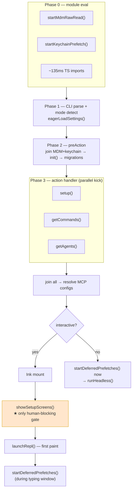

# 02 — Startup & Runtime Modes

This document covers how the process boots, the state it establishes, the
different ways it can run, and the build-time machinery (feature flags + macros)
that shapes the binary.

## Entrypoint hierarchy

### `src/entrypoints/cli.tsx` — fast-path dispatcher

The first executable module. Before loading the full CLI framework it checks for
special flags and short-circuits, using **dynamic imports** so nothing heavy is
loaded on these paths (`cli.tsx:36-93`):

- `--version` / `-v` / `-V` → print `MACRO.VERSION` and exit (zero extra imports;
  `MACRO.VERSION` is inlined at build time).
- `--dump-system-prompt` → render the system prompt for evals.
- `--claude-in-chrome-mcp`, `--chrome-native-host`, `--computer-use-mcp` →
  launch the respective MCP/native-host integrations.
- `--daemon-worker=<kind>` → spawn an internal daemon worker.
- `remote-control` / `rc` / `remote` / `sync` / `bridge` → bridge mode.
- `daemon [subcommand]` → long-running supervisor.
- `ps` / `logs` / `attach` / `kill` / `--bg` → background session management.

Anything else falls through to the main kernel.

### `src/main.tsx` — the CLI kernel (~4,683 lines)

Responsible for Commander.js parsing, mode detection, Ink initialization, and
launching the REPL or headless execution.

**Module-load side effects (before `main()` even runs)** — these fire while the
~135 ms of TypeScript imports are still resolving, so their cost is hidden:

- `profileCheckpoint('main_tsx_entry')` — startup profiling anchor.
- `startMdmRawRead()` — spawns `plutil` (macOS) / `reg query` (Windows)
  subprocesses to read managed-device-management settings (~40–65 ms),
  **in parallel** with imports.
- `startKeychainPrefetch()` — pre-reads OAuth tokens / API keys from the OS
  credential store asynchronously, so the synchronous read later in config
  loading is already warm.

These are later awaited in the Commander `preAction` hook
(`Promise.all([ensureMdmSettingsLoaded(), ensureKeychainPrefetchCompleted()])`),
by which point they have usually completed.

## The `STATE` singleton — `src/bootstrap/state.ts`

A mutable singleton (`STATE`, ~`state.ts:429`) created once and never
re-instantiated, holding all session-global runtime state. It is a **leaf** of
the import DAG (only imports `utils/` and `types/`), which lets it be imported
everywhere without circular-dependency risk. All access goes through typed
getters/setters (`getSessionId()`, `switchSession()`, …).

Key fields, grouped:

- **Identity:** `originalCwd`, `projectRoot` (stable for the session), `cwd`
  (mutable; changed by `EnterWorktreeTool`), `sessionId`, `parentSessionId`.
- **Runtime config:** `isInteractive`, `clientType`
  (`cli` / `sdk-typescript` / `sdk-python` / `sdk-cli` / `remote` / …),
  `sessionSource`, `mainLoopModelOverride`, `initialMainLoopModel`.
- **Permissions/execution:** `sessionBypassPermissionsMode`,
  `allowedSettingSources`, `inlinePlugins`, `flagSettingsPath`,
  `flagSettingsInline`.
- **Analytics:** `totalCostUSD`, `totalAPIDuration`, `totalToolDuration`,
  `modelUsage`, plus OpenTelemetry counters.
- **Multi-agent:** `mainThreadAgentType`, `agentColorMap`, `isRemoteMode`,
  `directConnectServerUrl`.
- **Persistence/resume:** `sessionProjectDir`, `teleportedSessionInfo`,
  `invokedSkills` (preserved across `/compact`), `sessionCronTasks`.

## The boot sequence

A condensed timeline (interactive REPL path):



The detailed sequence (interactive path):

```
Phase 0 — Module evaluation
  profileCheckpoint('main_tsx_entry')
  startMdmRawRead()         ─┐ run in parallel with the
  startKeychainPrefetch()    ├─ ~135ms of TypeScript imports
  <imports resolve> ────────┘
  profileCheckpoint('main_tsx_imports_loaded')

Phase 1 — CLI parsing & mode detection (main())
  signal handlers, Windows PATH-hijack guard
  URL / deep-link parsing (cc://, claude assistant, claude ssh)
  detect run mode (interactive vs print vs sdk vs init-only)
  eagerLoadSettings()       (pre-read --settings / --setting-sources)
  await run()               (Commander program)

Phase 2 — Commander preAction hook
  await Promise.all([ensureMdmSettingsLoaded(), ensureKeychainPrefetchCompleted()])
  await init()              (settings, env vars, auth, plugins, skills, MCP configs)
  initSinks()               (attach analytics handlers)
  runMigrations()           (config migrations)
  fire-and-forget: remote settings, policy limits, settings sync

Phase 3 — main action handler
  parse remaining flags (worktree, tmux, agent, permission mode, …)
  setupPromise = setup(...)         ← NOT awaited yet
  commandsPromise = getCommands()   ← kicked in parallel
  agentDefsPromise = getAgents()    ← kicked in parallel
  await setupPromise
  await Promise.all([commandsPromise, agentDefsPromise])
  resolve MCP configs (split SDK vs regular servers)

Phase 4a — interactive
  getRenderContext(); createRoot()             (Ink mount)
  await showSetupScreens(...)                  (trust dialog, OAuth, onboarding) ← may block on user
  fire-and-forget: quota, bootstrap, passes eligibility
  processSessionStartHooks(...)                (parallel)
  launchRepl(...)                              (render REPL; first paint)
  startDeferredPrefetches()                    (during "user is typing" window)

Phase 4b — non-interactive
  startDeferredPrefetches()                    (immediately)
  const { runHeadless } = await import('src/cli/print.js')
  void runHeadless(...)                        (fire-and-forget); return
```

Two initialization functions do the heavy lifting:

- **`init()`** (`src/entrypoints/init.ts`, called in `preAction`) — loads and
  merges all settings files, applies config env vars, resolves auth (OAuth /
  API key / apiKeyHelper / cloud creds), initializes plugins & skills, parses
  MCP configs, fetches remote-managed settings & policy limits (non-blocking),
  and initializes GrowthBook + analytics sinks. ~100–300 ms (mostly I/O).

- **`setup()`** (`src/setup.ts`) — per-session prep: restores interrupted
  terminal backups, snapshots the hooks config for integrity checks, creates
  the worktree if `--worktree`, initializes session memory, registers
  attribution hooks, emits the `tengu_started` beacon, and prefetches release
  notes. Called **without** `await` so its socket-bind work overlaps with the
  parallel command/agent discovery, then joined at `await setupPromise`.

## Run modes

Mode is detected in `main.tsx` from flags and TTY state:
`isNonInteractive = hasPrintFlag || hasInitOnlyFlag || hasSdkUrl || !process.stdout.isTTY`.
The `clientType` is classified from env (`GITHUB_ACTIONS`,
`CLAUDE_CODE_ENTRYPOINT`, `CLAUDE_CODE_SESSION_ACCESS_TOKEN`).

| Mode | Trigger | Behavior |
|---|---|---|
| **Interactive REPL** | default, TTY present | Full React/Ink UI; `launchRepl()`; trust/onboarding dialogs; the prompt loop. |
| **Print / headless** | `-p` / `--print`, or non-TTY stdin | No UI. `src/cli/print.ts` `runHeadless()` streams results to stdout as `text` / `json` / `stream-json`. Trust is implicit. |
| **SDK** | `--sdk-url` / `CLAUDE_CODE_ENTRYPOINT=sdk-*` | Structured I/O via control messages (`src/entrypoints/sdk/`); tool calls injected over a messaging channel. |
| **Init-only** | `--init-only` | Run session-start hooks and exit. |
| **Bridge / Remote Control** | `remote-control` / `--rc` | Connects an IDE extension to a CCR session; checks entitlement; see [08](08-bridge-remote-multiagent.md). |
| **Daemon** | `claude daemon` | Long-lived supervisor; spawns SDK workers per query. |
| **SSH remote** | `claude ssh <host>` | Probes/deploys remote, forwards an auth socket; tools run remote while UI renders locally. |

## Feature flags & build macros

### `bun:bundle` `feature()` gates

```ts
import { feature } from 'bun:bundle'
if (feature('KAIROS')) { /* … */ }
```

- **Production:** Bun's bundler performs dead-code elimination — branches behind
  a disabled flag are removed entirely from the binary (zero runtime cost).
- **Development:** `plugins/bunBundleDev.ts` shims `feature()` to read the
  `FEATURE_FLAGS` env var (comma-separated). All flags default to `false`.

```bash
FEATURE_FLAGS=KAIROS,VOICE_MODE bun run start
```

Notable flags seen in the source: `KAIROS`, `COORDINATOR_MODE`, `BRIDGE_MODE`,
`DAEMON`, `PROACTIVE`, `VOICE_MODE`, `AGENT_TRIGGERS`, `MONITOR_TOOL`,
`HISTORY_SNIP`, `CONTEXT_COLLAPSE`, `CACHED_MICROCOMPACT`, `TOKEN_BUDGET`,
`TRANSCRIPT_CLASSIFIER`, `SSH_REMOTE`, `DIRECT_CONNECT`, `BG_SESSIONS`,
`CHICAGO_MCP`, `TEAMMEM`.

These compile-time gates are distinct from **GrowthBook** runtime flags (see
[06](06-services-layer.md)), which are evaluated per-user/org for gradual
rollouts and A/B cohorts.

### `MACRO.*` build constants

Defined in `bunfig.toml` `[define]` and injected via Bun's `--define`:
`MACRO.VERSION`, `MACRO.BUILD_TIME`, `MACRO.PACKAGE_URL`,
`MACRO.NATIVE_PACKAGE_URL`, `MACRO.FEEDBACK_CHANNEL`, `MACRO.ISSUES_EXPLAINER`,
`MACRO.VERSION_CHANGELOG`. Used in version output, help text, and error/feedback
messages.

## Lazy-loading patterns

- **Feature-gated `require()`** — wrapped so DCE removes the import when the
  flag is off (e.g. the coordinator module in `main.tsx`).
- **Dynamic `import()`** — provider SDKs, OpenTelemetry, gRPC, and print mode
  are imported only when reached.
- **`setImmediate()` deferral** — e.g. attribution-hook git subprocesses are
  deferred to the next tick, after first render.

## Profiling

`src/utils/startupProfiler.ts` records `profileCheckpoint(name)` markers
throughout boot and `profileReport()` at shutdown, surfacing wall-clock deltas
between milestones. Enable with `CLAUDE_CODE_DEBUG_STARTUP=1` or `--debug startup`.

## Key files

| File | Role |
|---|---|
| `src/entrypoints/cli.tsx` | Fast-path flag dispatcher |
| `src/main.tsx` | CLI kernel: parse, mode dispatch, REPL launch |
| `src/bootstrap/state.ts` | `STATE` singleton |
| `src/entrypoints/init.ts` | Config/auth/plugin/MCP loading |
| `src/setup.ts` | Per-session preparation |
| `src/cli/print.ts` | Headless execution (`runHeadless`) |
| `src/replLauncher.tsx` | REPL launch |
| `bunfig.toml` | Build-time macros & defines |
| `plugins/bunBundleDev.ts` | Dev feature-flag shim |
| `src/utils/startupProfiler.ts` | Startup checkpoint profiling |
