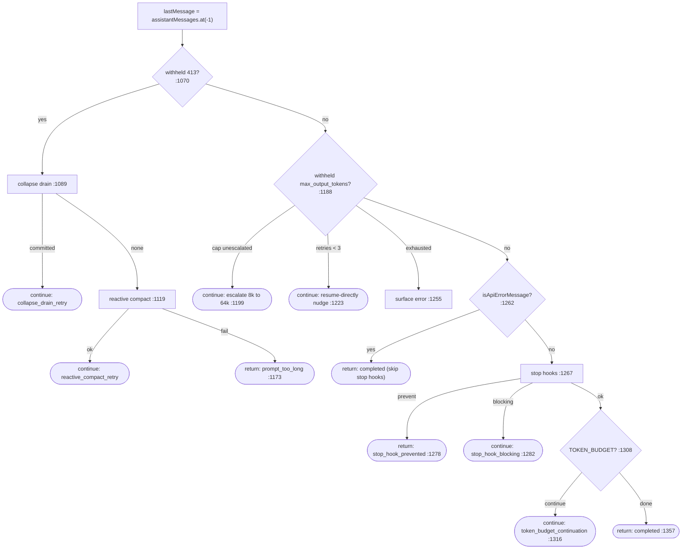

# 14a — Deep Dive: The Agent Loop & Recovery State Machine

A line-by-line walk of `src/query.ts` — the `while (true)` loop that drives one
user turn through the model, executes tools, and recovers from errors. This is
the single most important control-flow file in the codebase. See
[03](03-query-engine.md) for the higher-level overview.

> All citations are `src/query.ts` unless noted.

## The shape: a generator that returns a `Terminal`

```ts
export async function* query(params): AsyncGenerator<
  StreamEvent | RequestStartEvent | Message | TombstoneMessage | ToolUseSummaryMessage,
  Terminal
> {
  const consumedCommandUuids: string[] = []
  const terminal = yield* queryLoop(params, consumedCommandUuids)   // :230
  for (const uuid of consumedCommandUuids) notifyCommandLifecycle(uuid, 'completed')
  return terminal
}
```

`query` (`:219`) is a thin wrapper around **`queryLoop`** (`:241`). The
`yield*` delegates the entire stream; the post-loop `for` only runs if the loop
**returned normally** — on throw or `.return()` it's skipped, giving an
*"asymmetric started-without-completed signal"* (`:231-237`) used to detect
failed turns.

## State lives in one mutable object

The loop's defining design choice: **all cross-iteration state is one object**,
re-assigned wholesale at each `continue` site rather than mutating 9 variables.

```ts
type State = {                                  // :204-217
  messages, toolUseContext,
  autoCompactTracking, maxOutputTokensRecoveryCount,
  hasAttemptedReactiveCompact, maxOutputTokensOverride,
  pendingToolUseSummary, stopHookActive, turnCount,
  transition: Continue | undefined   // "Why the previous iteration continued."
}
```

The comment on `transition` (`:214-216`) states its purpose: *"Lets tests assert
recovery paths fired without inspecting message contents."* It's the label on
the state-machine edge — `'collapse_drain_retry'`, `'reactive_compact_retry'`,
`'max_output_tokens_escalate'`, etc.

Each iteration **destructures `state` at the top** (`:311-321`) so reads stay
bare-name; only `toolUseContext` is reassigned mid-iteration. The rationale is
spelled out at `:265-267`: *"Continue sites write `state = { ... }` instead of 9
separate assignments."*

A few things deliberately live **outside** `State`:
- `taskBudgetRemaining` (`:291`) — *"Loop-local (not on State) to avoid touching
  the 7 continue sites."*
- `budgetTracker` (`:280`), `config` snapshot (`:295`), and a `using`
  memory-prefetch (`:301`) that disposes on every generator exit path.

## One iteration, step by step

### 1. Per-iteration setup (`:307-363`)

- Start a **skill-discovery prefetch** that runs *while the model streams*
  (`:331`), replacing a blocking path that *"found nothing in prod"* 97% of the
  time (`:328-330`).
- `yield { type: 'stream_request_start' }` (`:337`).
- Build/increment **query-chain tracking** (`chainId` + `depth`, `:347-355`) for
  nested-agent analytics.

### 2. Message preparation (`:365-543`) — the compaction ladder

Covered in detail in [14d](14d-deep-dive-compaction.md). In order:

1. `getMessagesAfterCompactBoundary(messages)` (`:365`) — only process messages
   after the last compaction.
2. `applyToolResultBudget(...)` (`:379`) — cap aggregate tool-result size; runs
   *before* microcompact so the two *"compose cleanly"* (`:369-372`).
3. **Snip** (`:401-410`, `HISTORY_SNIP`) → `snipTokensFreed`, plumbed to
   autocompact so its threshold *"reflects what snip removed"* (`:397-399`).
4. **Microcompact** (`:414-426`) → maybe `pendingCacheEdits` (deferred boundary).
5. **Context collapse** (`:440`) — runs before autocompact so granular context
   survives if it gets under threshold.
6. **Autocompact** (`:454`).

### 3. The streaming call (`:659-708`)

`deps.callModel({...})` is consumed with `for await`. Notable options assembled
here: `messages: prependUserContext(messagesForQuery, userContext)` (`:660`),
the current model, fast-mode (only when gated, `:671`), `fallbackModel` +
`onStreamingFallback` (`:677-680`), MCP tools/pending-servers (`:689-692`), and
the `taskBudget` with carried-over `remaining` (`:699-706`).

### 4. Inside the stream loop (`:708-863`)

For each streamed `message`:

**a. Fallback cleanup (`:712-741`).** If a streaming fallback occurred, emit
**tombstones** for the orphaned partial messages (`:716-718`) — *"partial
messages (especially thinking blocks) have invalid signatures that would cause
'thinking blocks cannot be modified' API errors"* — clear the accumulators, and
rebuild the `StreamingToolExecutor` so stale `tool_use_id`s aren't yielded
(`:733-740`).

**b. Backfill, but don't mutate the original (`:742-787`).** Tool inputs are
backfilled on a **clone** for the yielded/transcript copy; the original flows
back to the API untouched because *"mutating it would break prompt caching (byte
mismatch)"* (`:744-746`). And the clone is only made when backfill **added**
fields, not overwrote — overwrites *"break VCR fixture hashes on resume"*
(`:765-770`).

**c. Withhold recoverable errors (`:788-825`).** Prompt-too-long, media-size,
and max-output-tokens errors are *withheld* (`withheld = true`) — not yielded yet
— but **still pushed to `assistantMessages`** so the recovery checks below find
them (`:788-791`). The comment notes each subsystem's withhold is independent and
sufficient on its own. `feature()` checks are nested rather than composed because
of the *"bun:bundle tree-shaking constraint"* (`:796-797`).

**d. Accumulate + stream tools (`:826-862`).** Assistant messages are pushed;
`tool_use` blocks set `needsFollowUp = true` (`:834`) and are immediately handed
to `streamingToolExecutor.addTool(...)` (`:841-843`) — **this is the
execute-while-streaming optimization** ([04](04-tool-system.md)). Completed tool
results are drained and yielded as they finish (`:847-862`).

### 5. The deferred microcompact boundary (`:866-874+`)

If `CACHED_MICROCOMPACT` had `pendingCacheEdits`, the boundary message is yielded
*now*, using the API's actual `cache_deleted_input_tokens` (subtracting the
pre-request baseline because the field is *"cumulative/sticky across requests"*,
`:872`) instead of a client-side estimate.

## The recovery state machine (`:1062-1357`)

When `!needsFollowUp` (the model stopped requesting tools), the loop decides
whether the turn is *done* or needs *recovery*. This is an ordered cascade; each
branch either `continue`s (re-enters the loop with new `state`) or `return`s a
`Terminal`.



Each `continue` node rebuilds `state` and re-enters the loop; each `return` node
exits with a `Terminal` reason.

### Why the ordering and the guards matter

- **Cheap before lossy.** Collapse drain (reversible, keeps granular context) is
  tried before reactive compact (a lossy summary), gated on the previous
  transition *not* already being `'collapse_drain_retry'` (`:1092`) — so a
  second 413 falls through instead of re-draining.

- **Media skips collapse** (`:1074-1077`): *"collapse doesn't strip images."*

- **Don't run stop hooks on API errors** (`:1168-1172`, `:1258-1261`). This is
  stated twice as a hard rule: doing so *"creates a death spiral: error → hook
  blocking → retry → error → … (the hook injects more tokens each cycle)."* On a
  withheld 413 that can't recover, the code surfaces the error and `return`s
  immediately rather than falling through.

- **`hasAttemptedReactiveCompact` is latched across stop-hook retries**
  (`:1292-1297`): the comment documents a real incident — resetting it to
  `false` here *"caused an infinite loop: compact → still too long → error → stop
  hook blocking → compact → … burning thousands of API calls."*

- **Max-output escalation is single-shot**, guarded by
  `maxOutputTokensOverride === undefined` (`:1201`); the multi-turn nudge is
  bounded by `MAX_OUTPUT_TOKENS_RECOVERY_LIMIT` (`:1223`). The nudge text itself
  (`:1226-1227`) tells the model to *"Resume directly — no apology, no recap…"*.

### 6. Tool execution (`:1360+`)

When `needsFollowUp` is true, control falls past the recovery block to tool
execution. If a `streamingToolExecutor` ran, its results are already in hand
(logged as `tengu_streaming_tool_execution_used`, `:1367`); otherwise tools run
here. Results merge into `updatedToolUseContext`, and the loop `continue`s for
the next model turn.

## The mental model

`queryLoop` is a **state machine over `State`**, where:
- the *happy path* is: prepare → stream → execute tools → `continue`;
- every *failure* is a labeled edge (`transition.reason`) back into the loop with
  a modified `State`;
- every edge is **bounded** (single-shot escalation, ≤3 nudges, latched compact
  guard) so no turn can loop forever;
- the *exits* are a small set of `Terminal` reasons: `completed`,
  `prompt_too_long`, `image_error`, `stop_hook_prevented`.

The unusual "one big `State` object, reassigned at each `continue`" pattern
exists precisely because there are **7 continue sites**: keeping them in sync as
separate variables would be error-prone, so the code makes each edge construct a
complete `next: State` explicitly — you can read any one branch and see the full
resulting state.

Next: [14b — Ink rendering pipeline](14b-deep-dive-ink-rendering.md).
