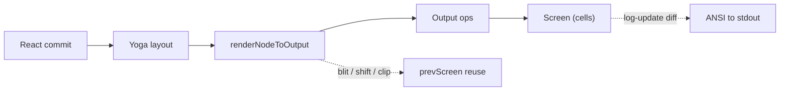

# 14b — Deep Dive: The Ink Rendering Pipeline

A line-by-line walk of how a React component tree becomes ANSI bytes on the
terminal, via the custom renderer in `src/ink/`. The headline trick is that the
renderer behaves like a tiny GPU: it keeps a previous frame buffer and only
repaints what actually changed, using copy-from-previous ("blit") and hardware
scroll where possible. See [05](05-command-and-ui-system.md) for the overview.



## Stage 1 — Throttled render scheduling (`src/ink/ink.tsx`)

React commits can fire faster than the terminal can repaint, so renders are
**throttled** with a lodash `throttle` at a frame interval (`ink.tsx:4`, `:79-81`).
A render is only scheduled when something is **dirty** — `markDirty` in the
reconciler walks up the tree marking ancestors so the scheduler knows there's
work. Double buffering keeps a `frontFrame` and `backFrame` (`ink.tsx:99-100`):
the new frame renders into the back buffer, then the two pointers swap — no
per-frame allocation.

`SIGWINCH` (resize) sets an erase-before-paint flag so the next frame clears the
terminal; `SIGCONT` (resume from Ctrl-Z) calls `LogUpdate.reset()`
(`log-update.ts:60-63`) to forget the stale previous frame so the diff starts
fresh instead of clobbering whatever the shell drew.

## Stage 2 — Commit → layout → render (`src/ink/reconciler.ts`)

The reconciler implements `react-reconciler`'s HostConfig.

- **`createInstance`** (`reconciler.ts:331-359`) — `createNode(type)` then applies
  each prop (`applyProp`) for style/attributes/handlers.
- **`commitUpdate`** (`:426-459`) — shallow-`diff`s old vs new props and old vs new
  `style` separately. Crucially, **event handlers are stored separately** from
  attributes (`setEventHandler` → `node._eventHandlers`, `:114-119`): a handler
  whose *identity* changed each render (a common React pattern) must **not** mark
  the node dirty and trigger a repaint, because the painted output is identical.
- **`resetAfterCommit`** (`:247-315`) is the per-commit hook: it runs Yoga layout
  via `rootNode.onComputeLayout()` (`:277`) then triggers the paint via
  `rootNode.onRender?.()` (`:303`).

## Stage 3 — The recursive paint with blit reuse (`src/ink/render-node-to-output.ts`)

`renderNodeToOutput` (`:387-1227`) walks the laid-out tree emitting drawing
operations into an `Output` buffer. The cleverness is in *avoiding* work.

### The blit fast path (`:454-482`)

```ts
const cached = nodeCache.get(node)
if (
  !node.dirty && !skipSelfBlit &&
  node.pendingScrollDelta === undefined &&
  cached &&
  cached.x === x && cached.y === y &&
  cached.width === width && cached.height === height &&
  prevScreen
) {
  output.blit(prevScreen, Math.floor(x), Math.floor(y), Math.floor(width), Math.floor(height))
  // …skip rendering the entire subtree
}
```

If a node is **clean** and its layout box is **unchanged** since last frame, the
renderer copies its rectangle straight from `prevScreen` — `O(1)` instead of
re-walking every descendant. This is why a steady-state UI (just a spinner
animating) costs almost nothing: the rest of the tree blits.

### Layout-shift gating (`:34`, `:494-495`)

A module-level `let layoutShifted = false` flips to `true` when any node's
position/size changed or a child was removed. `ink.tsx` reads `didLayoutShift()`
to decide between a **narrow-damage** diff (only changed cells) and a
full-damage fallback. Steady frames keep it `false`, keeping damage tight.

### Hardware scroll via DECSTBM (`:863-884`, `:917-1061`)

For a scroll box whose content moved but whose container didn't, the renderer
emits a **scroll hint** `{ top, bottom, delta }` — but only when the shift fits
the viewport (`Math.abs(delta) < innerHeight`, `:877`). The fast path then:
1. `output.blit(prevScreen, …)` the scroll region (`:920`),
2. `output.shift(top, bottom, delta)` (`:921`) — which `log-update` turns into a
   terminal *hardware scroll* (`DECSTBM` set-scroll-region + `SU`/`SD`) instead
   of rewriting every visible row,
3. clears + re-renders only the newly-exposed edge rows (`:923-1061`).

## Stage 4 — Output ops applied to the cell grid (`src/ink/output.ts`)

`Output.get()` (`:268-531`) replays the collected operations (`write`, `blit`,
`clip`/`unclip`, `clear`, `shift`) onto a `Screen`. `blit` intersects with the
active clip rect and the screen bounds, taking a fast `blitRegion` path when no
absolute-node clears are pending (`:330-345`). Text writes go through a
**per-line char cache** (`:641-651`):

```ts
let characters = charCache.get(line)
if (!characters) {
  characters = reorderBidi(
    styledCharsWithGraphemeClustering(styledCharsFromTokens(tokenize(line)), stylePool),
  )
  charCache.set(line, characters)   // tokenize+cluster is O(len); cache so unchanged lines skip it
}
```

## Stage 5 — The cell grid & interning pools (`src/ink/screen.ts`)

The `Screen` stores cells in a **packed** form — two `Int32`s per cell
(`screen.ts:332-348`): word0 is a char-pool index; word1 packs
`styleId | hyperlinkId | width` via bit shifts (`STYLE_SHIFT = 17`,
`HYPERLINK_SHIFT = 2`). The comment notes this *"halves memory accesses in
diffEach"* versus per-cell objects.

Three interning pools eliminate per-frame allocations:
- **`CharPool`** (`:21-53`) — interns grapheme clusters; ASCII single-chars take
  an `Int32Array` fast path (`:29-40`).
- **`StylePool`** (`:112-162`) — interns `AnsiCode[]` and, critically, **caches
  pre-serialized ANSI transitions** between style IDs (`transition(fromId,
  toId)`, `:153-162`): *"Zero allocations after first call for a given
  fromId→toId pair."*
- **`HyperlinkPool`** (`:57-75`) — session-lived (never reset), so OSC-8 link IDs
  stay valid across frames.

## Stage 6 — Frame diff to ANSI (`src/ink/log-update.ts`)

`render` (`:123-467`) turns the new `Screen` + previous `Screen` into escape
sequences.

**Full-redraw triggers** (the slow, flicker-causing path) — when the viewport
shrank or width changed (`:142-147`), or scrollback geometry changed
(`:214-248`). Otherwise the **per-cell diff** runs:

```ts
diffEach(prev.screen, next.screen, (x, y, removed, added) => {
  if (growing && y >= prev.screen.height) return         // new rows handled elsewhere
  if (added && added.width === CellWidth.SpacerTail) return  // skip wide-char tails
  if (added && isEmptyCellAt(next.screen, x, y) && !removed) return  // skip no-op blanks
  moveCursorTo(screen, x, y)
  if (added) writeCellWithStyleStr(screen, added, stylePool.transition(currentStyleId, added.styleId))
  else if (removed) /* clear with a space */
})
```

This is `O(changed cells)`, not `O(rows × cols)`. Cursor motion
(`moveCursorTo`, `:693-721`) prefers carriage-return + relative moves and handles
the terminal's pending-wrap quirk.

## The mental model

The renderer treats the terminal as a **retained-mode display** even though it's
really a stream of escape codes. It keeps the last painted `Screen`, and every
frame answers one question per region: *did this actually change?*
- No → **blit** it from the previous screen (or skip the whole subtree).
- Yes but only scrolled → **hardware scroll** (DECSTBM) the region.
- Yes → diff **cell by cell** and emit the minimal cursor-move + style-transition
  + write sequence.

Interning pools and per-line/transition caches mean that the common case
(unchanged text, unchanged styles) touches almost no allocations. The result is
a React UI that can update at interactive rates over a serial ANSI stream.

Next: [14c — Bash security validation](14c-deep-dive-bash-security.md).
