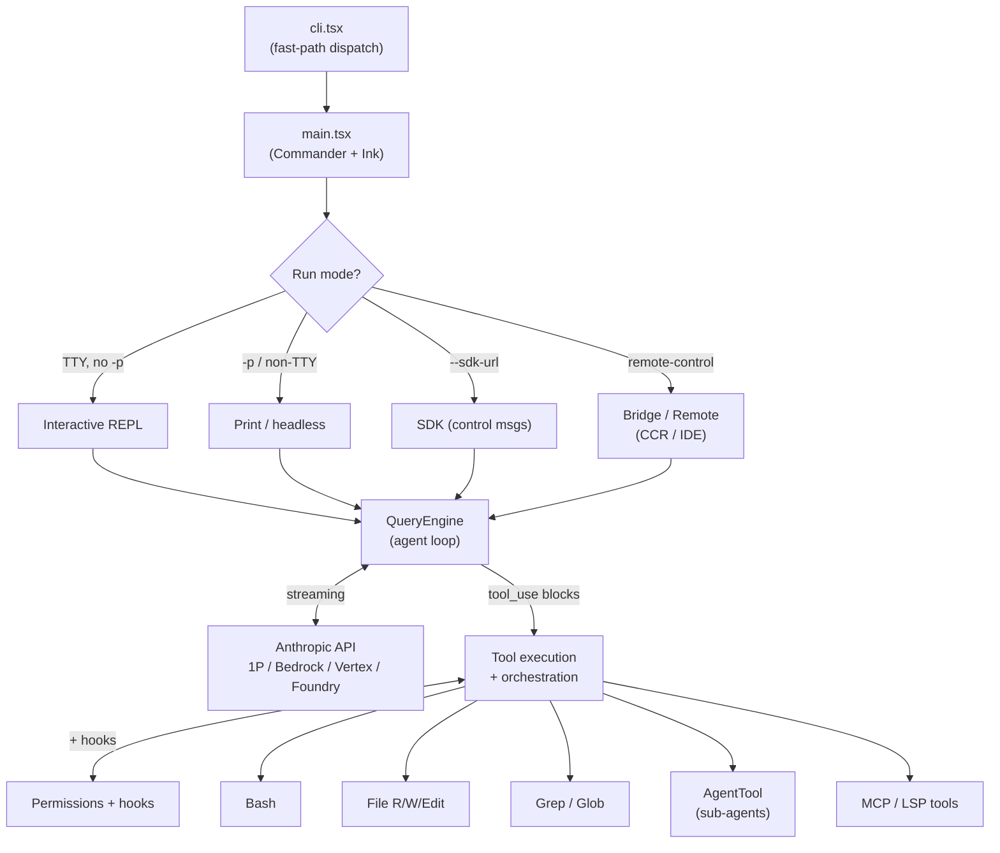

# Claude Code — Architecture Documentation

This folder contains a detailed architectural reference for the Claude Code CLI
(the leaked `src/` tree, ~1,976 TypeScript files / ~513K lines). It was produced
by reading the source directly and is organized so you can start from the
high-level picture and drill into any subsystem.

> Scope note: This documents the code as it exists in this repository. Some
> Anthropic packages (`@ant/*`, sandbox runtime, MCPB) are present only as no-op
> **stubs** under `stubs/`. The two that are public on npm
> (`@anthropic-ai/sandbox-runtime`, `@anthropic-ai/mcpb`) were fetched and their
> real behavior is documented in [12 — Vendored Packages](12-vendored-packages.md);
> the private `@ant/*` ones remain stubs, so only their call sites are described.

## How to read this

Start with **[01 — System Overview](01-overview.md)** for the 10,000-foot view,
the tech stack, and the cross-cutting design principles. Then jump to whichever
subsystem you care about. Each document is self-contained and cites concrete
files with `file:line` references you can click.

## Table of Contents

| # | Document | What it covers |
|---|----------|----------------|
| 01 | [System Overview](01-overview.md) | The big picture, tech stack, directory map, cross-cutting principles, request lifecycle |
| 02 | [Startup & Runtime Modes](02-startup-and-runtime-modes.md) | Entrypoints, bootstrap state, the boot sequence, the run modes (REPL / print / SDK / bridge / daemon / ssh), feature flags & build macros |
| 03 | [Query Engine & Agent Loop](03-query-engine.md) | `QueryEngine`, the streaming tool-call loop, context assembly, compaction, retries, multi-provider API, cost tracking |
| 04 | [Tool System](04-tool-system.md) | The `Tool` interface, registry, execution/orchestration pipeline, Bash security, the full tool catalog, deferred tool loading |
| 05 | [Command System & Terminal UI](05-command-and-ui-system.md) | Slash commands, the custom React/Ink renderer, Yoga layout, screens, input handling, Vim mode |
| 06 | [Service Layer](06-services-layer.md) | MCP, OAuth, LSP, analytics & feature flags, the multi-provider API client, and supporting services |
| 07 | [Permissions & Hooks](07-permissions-and-hooks.md) | The permission decision pipeline, permission modes & rule sources, the lifecycle hooks system |
| 08 | [Bridge, Remote & Multi-Agent](08-bridge-remote-multiagent.md) | IDE bridge protocol, remote/CCR sessions, tasks, teams, the coordinator, sub-agent orchestration |
| 09 | [Skills & Plugins](09-skills-and-plugins.md) | Skill lifecycle & sources, the plugin architecture, marketplaces, installation, what plugins contribute |
| 10 | [Memory & Context](10-memory-and-context.md) | The persistent memory directory, session memory, auto-dream consolidation, team memory sync |
| 11 | [Configuration & State](11-configuration-and-state.md) | Settings hierarchy & precedence, config migrations, Zod schemas, the global app-state store |
| 12 | [Vendored / External Packages](12-vendored-packages.md) | Real behavior of the stubbed `@anthropic-ai/sandbox-runtime` (OS sandboxing) and `@anthropic-ai/mcpb` (MCP bundles), fetched from npm; notes on the private `@ant/*` stubs |
| 13 | [Design Decisions & Rationale](13-design-decisions.md) | The *why* behind the recurring patterns — fail-closed defaults, streaming, prompt-cache stability, layered recovery/compaction, defense-in-depth, and more |

### Conceptual deep-dives (Phases 2–3, in progress)

These complement the subsystem reference above with design rationale, algorithm
walk-throughs, and end-to-end traces:

- **13** — [Design Decisions & Rationale](13-design-decisions.md) *(done)*
- **14** — Algorithm deep-dives *(done)*:
  - [14a — The Agent Loop & Recovery State Machine](14a-deep-dive-agent-loop.md)
  - [14b — The Ink Rendering Pipeline](14b-deep-dive-ink-rendering.md)
  - [14c — Bash Command Security & Read-Only Validation](14c-deep-dive-bash-security.md)
  - [14d — The Compaction Cascade](14d-deep-dive-compaction.md)
- **15** — End-to-end data-flow walkthroughs *(done)* — each traces one concrete scenario through every layer it touches:
  - [15a — A prompt that edits a file](15a-walkthrough-prompt-to-edit.md)
  - [15b — A skill that forks a sub-agent](15b-walkthrough-subagent-fork.md)
  - [15c — An MCP tool call](15c-walkthrough-mcp-call.md)
  - [15d — Resuming a previous session](15d-walkthrough-session-resume.md)
  - [15e — Auto-compaction firing mid-conversation](15e-walkthrough-autocompaction.md)
  - [15f — A permission prompt, denial, and re-prompt](15f-walkthrough-permission-denial.md)
  - [15g — From `claude` to the first prompt (startup)](15g-walkthrough-startup.md)
  - [15h — A remote / IDE-bridge session](15h-walkthrough-bridge-session.md)
  - [15i — Background memory extraction & consolidation](15i-walkthrough-memory-extraction.md)

## Quick subsystem map

See [01 — System Overview](01-overview.md) to begin.
